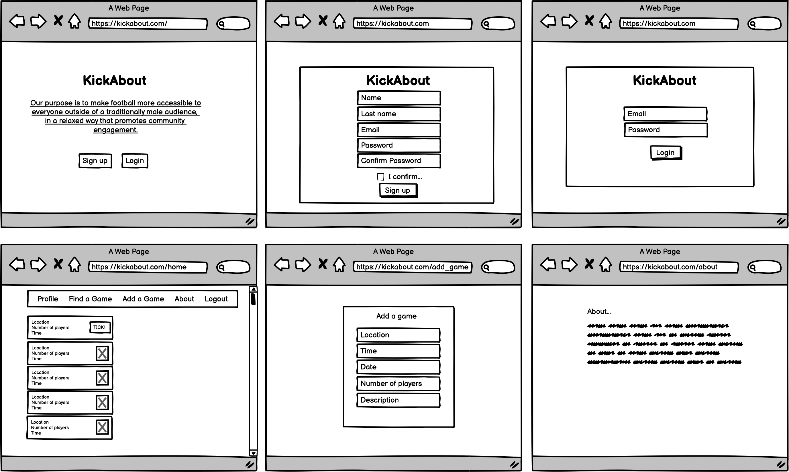
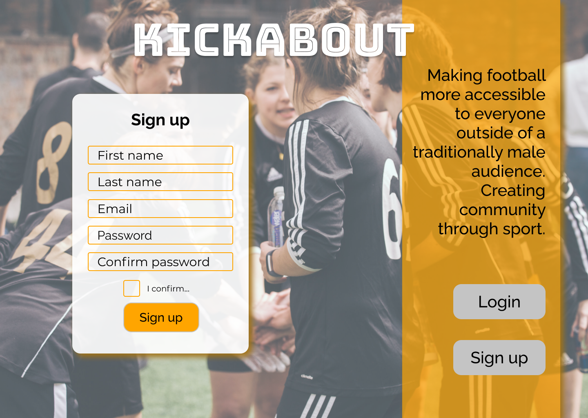
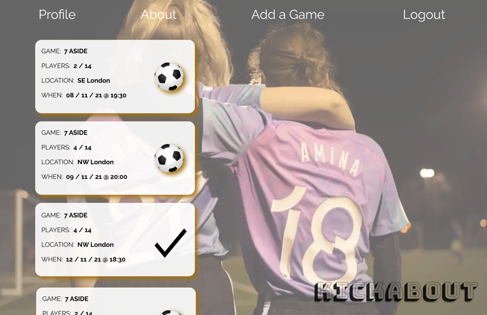

# KickAbout

Making football more accessible to everyone outside of a traditional male audience. A webapp designed for organising and finding football games in your local area. Creating community through sport.

## The Team

[](https://github.com/Legal-Dan) Daniel | [](https://github.com/jordanveness) Jordan | [](https://github.com/rhianekobar) Shakira | [](https://github.com/lildann) Lilly 

## Run Through 
App demonstration begins at 5.30
[Kickabout Presentation](https://drive.google.com/file/d/1ncL-M8ReYK1MoS18YFDta_l3b7Za30tp/view?usp=sharing)


## Planning
### Trello Board

We used a Trello board to organise our workflow, you can find it [here](https://trello.com/b/M4iPzBw3/kickabout)

### MVP User Stories
```
As a player
So I can join a football community
I want to be able to sign up to KickAbout

As a player
So I can see football games that are upcoming 
I want to be able to login to my account

As a player
So I can organise a game at a specific time / date / place
I want to be able to add a game

As a player
So I can play a game
I want to be able to sign up to join a game
```

### MVP 

* Sign up
* Log in
* See all games
* Add a game
* Delete game (only creator of game can delete)
* Join a game



### Figma Layout Designs

We used Figma to visualise KickAbout and plan the layout and features, you can find it [here](https://www.figma.com/file/7GFETOsGVeKdzKqbFdL3Dz/KickAbout?node-id=0%3A1)



#### Domain model and Database Tables
##### User:
- devise for authentication and authorization
- first name: VARCHAR(60)
- last name: VARCHAR(60)

##### Game:
- game_id: SERIAL PRIMARY KEY
- location: VARCHAR(250)
- datetime: DATETIME
- user_id(host): FOREIGN KEY
- no_of_players: INT
- description: VARCHAR(500)

##### Game_players:
- game_id: FOREIGN_KEY
- user_id: FOREIGN_KEY
